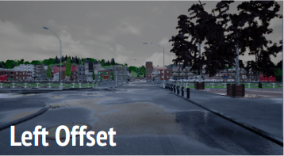
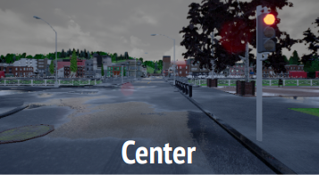
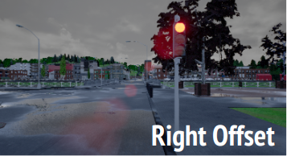

# wustlcarla

# CARLA Autonomous Driving Challenge 2019 (CVPR CARLA AD Challenge Workshop 2019)
[[arXiv]]() **extended version**: to be appear

We built a self-driving model based on Dr. Felipe Codevilla's Imititation Learning model. We called it Tarzan based on an old movie of the same name called Tarzan, the Wonder Car about a car that could drive itself. But, it turned out that a purely Imitation Learning model despite being able to drive on empty roads pretty well even in unseen scenarious, does not work very well when traffic rules need to be followed, like following traffic lights, not hitting pedestrians and other vehicles. Hence, we added the popular object detection model, YOLO to detect traffic lights, pedestrians and other vehicles. Using the information from YOLO, we added heuristics that allowed our model to drive more successfully, like seen below. 

Since this model was significantly better than Tarzan, we named it Jane (after Tarzan's better half), although we did forget to mention this name change to the CARLA challenge organizers, so officially, Tarzan is still the model that beat University of Michigan to come 3rd. 

We were able to successfully create a model named Jane, which helped us secure the 3rd place in the competition, which gave us the opportunity to present at CVPR 2019 in Long Beach, California. 

|
Conceptual Overview
 | 
| :---: |
<video src="media/stop.mp4" controls="controls" style="max-width: 730px;">
</video>

|
Turn Left
 | 
Go Straight
|
Turn Right
 |
| :---: | :---: | :---: |
| |  |  |

 
Teammates: Adith Boolor and Karthik Garimella.
